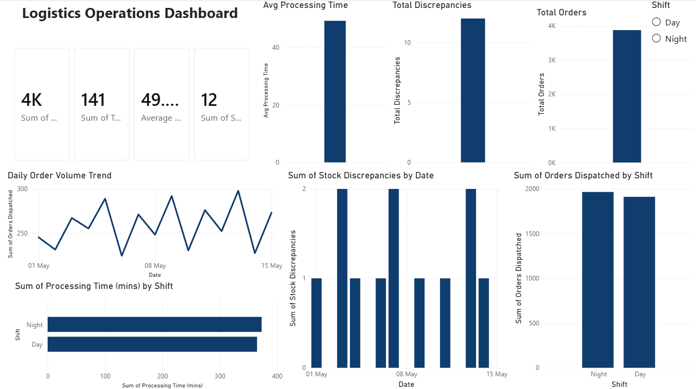
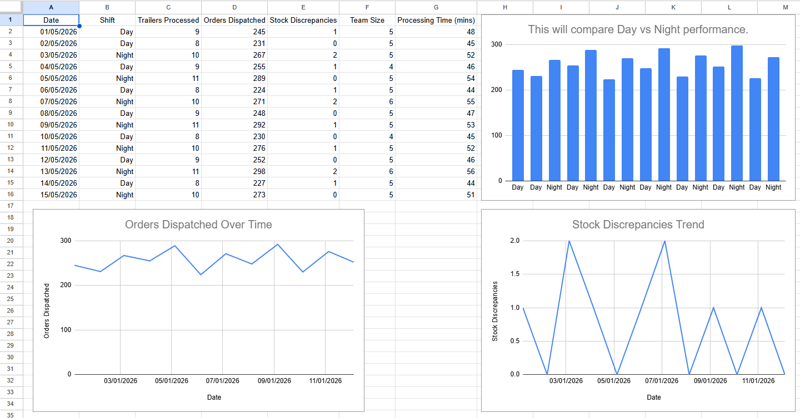

# Logistics Operations Analysis Dashboard

## Overview

This project analyses logistics operations data from a warehouse and automotive manufacturing environment. The project combines Power BI, SQL and Excel-based analysis to track operational performance, identify trends and support data-driven decision-making.

The dataset is based on logistics processes including order dispatch, trailer processing, processing times, shift performance and stock discrepancies.

## KPIs Analysed

- Orders Dispatched
- Trailers Processed
- Processing Time
- Stock Discrepancies
- Shift Performance

## Tools Used

- Power BI
- DAX
- SQL (SQLite)
- Excel
- Data Visualisation

## SQL Analysis

SQL queries were created to analyse operational performance, including:

- Total orders processed
- Orders completed by shift
- Average processing time by shift
- Stock discrepancy analysis

Example insights:

- Total orders processed: 3,878
- Day shift average processing time: 45.6 minutes
- Night shift average processing time: 53.3 minutes

## Power BI Dashboard Features

- Interactive dashboard
- KPI cards
- Shift filtering
- Trend analysis
- Performance comparison
- Operational insights

## Project Files

- Logistics Operations Dashboard.pbix - Power BI dashboard
- Logistics Operations Dashboard - Sheet1.csv - Dataset
- logistics_analysis.sql - SQL queries
- logistics_operations.db - SQLite database

## Key Skills Demonstrated

- Data cleaning and preparation
- KPI reporting
- SQL querying
- Data visualisation
- Operational performance analysis
- Business insight generation

## Dashboard Preview

### Overview

### Shift Performance

